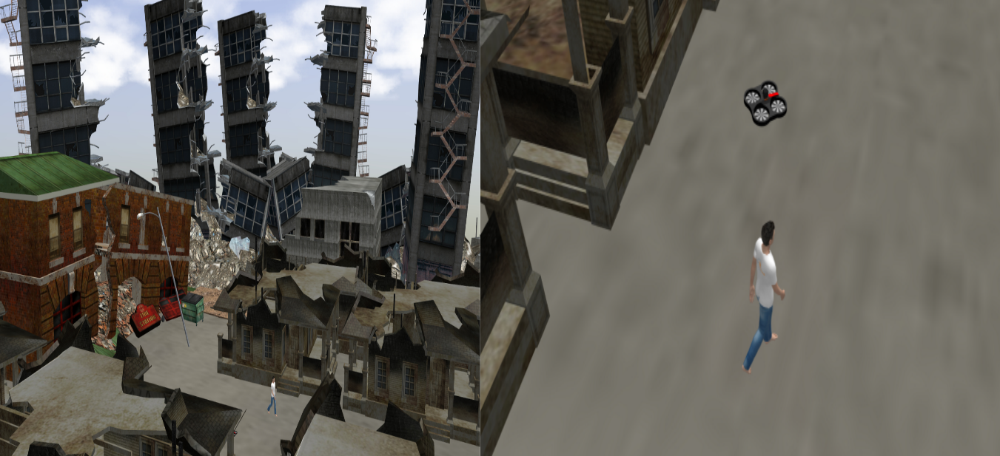
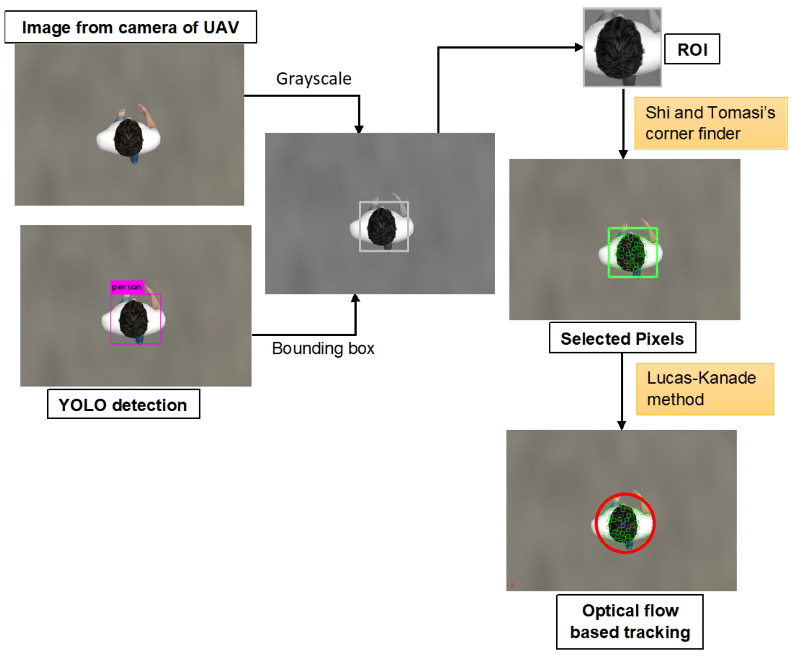
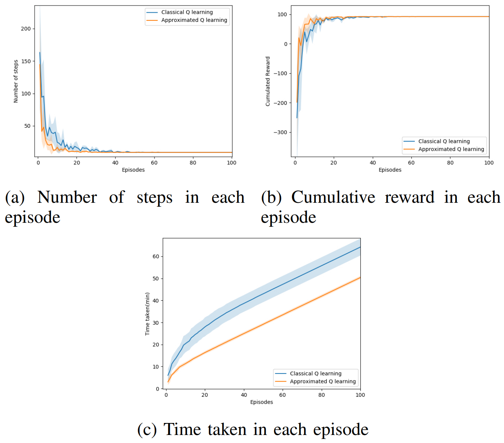

## 🚁 UAV-SaR-Tracking

📄 Paper Link: https://ieeexplore.ieee.org/abstract/document/9292630 

<div style="width: 100%; text-align: center; margin:auto;">
      
</div>

## 🤖 Autonomous UAV-based Target Search, Tracking and Following using Reinforcement Learning and YOLOFlow

ROS Package to implement reinforcement learning algorithms for autonomous navigation of UAV in a Search-and-Rescue environment. A PID algorithm is employed for position control.

## 📦 Dependencies Installation
- Prerequisites
  * Ubuntu 16.04 
  * ROS Kinetic

- Create & build ROS workspace
```
mkdir -p ~/UAV_SaR_ws/src
cd ~/UAV_SaR_ws/
catkin_make
source devel/setup.bash
```

- Clone this repository
```
cd src
git clone https://github.com/SuryaPratapSingh37/UAV-SaR-Tracking.git
```

- Install OpenAI gym and <a href="https://github.com/erlerobot/gym-gazebo">gym_gazebo</a> package:
```
sudo pip install gym
sudo apt-get install python-skimage
sudo pip install h5py
pip install tensorflow-gpu (if you have a gpu if not then just pip install tensorflow)
sudo pip install keras

git clone https://github.com/erlerobot/gym-gazebo
cd gym-gazebo
sudo pip install -e .
```
- Ardrone simulation: 
```
cd ~/UAV_SaR_ws/quadrotor_ros/ardrone/qlab_gazebo
rosdep install --from-paths . -i
```

- Build this package:
```
cd ~/UAV_SaR_ws
catkin_make
```

## 🌐 RL Environment
- State: Discrete(X,Y Coordinate obtained from generic odometry sensor).
- Action: Forward, Back, Left, Right.
- Space: 10x10 grid space.
- Goal/Victim initial position: [4,5]
- Reward: -1 at each step, -10 if the UAV goes out of limits and +100 when the UAV reaches the goal state.
- Parameters: <br />
   * alpha = 0.8 (learning rate) 
   * gamma = 0.9 (discount factor) 
   * epsilon = 0.1 (𝜖 -greedy action selection)  

<p align= "center">

</p>

## 🔍 YoloFLOW algorithm
<div style="width: 100%; text-align: center; margin:auto;">
      
</div>

## 🛠️ Running Simulation
1. Launch simulation of AR Drone in Gazebo : (forked from [Qlabs](https://github.com/pulver22/QLAB))
```
roslaunch qlab_gazebo drone.launch
```
or
```
roslaunch cvg_sim_gazebo drone.launch
```

2. (Optional) Teleop the quadrotor using keyboard :
```
rosrun quadrotor_teleop_keyboard quadrotor_teleop_keyboard.py
```

3. (Optional) Perform PTAM (Parllel Tracking and Mapping) for visual navigation : ([More Info](https://vision.in.tum.de/data/software/tum_ardrone))
```
roslaunch tum_ardrone tum_ardrone.launch
```

## 🏋️ Q-learning (Training)

```
roslaunch rl_mav_ros start_qlearning.launch
```

## 📊 Results
<div style="width: 100%; text-align: center; margin:auto;">
      
</div>

## 🙏 Credits
This project builds upon the good work done in the [openai_ros](https://wiki.ros.org/openai_ros), [gym-gazebo](https://github.com/erlerobot/gym-gazebo), and [QLAB](https://github.com/pulver22/QLAB). Many thanks to all the contributors involved.<br>
Special thanks to my project member, Yug Ajmera, for his invaluable contributions.


